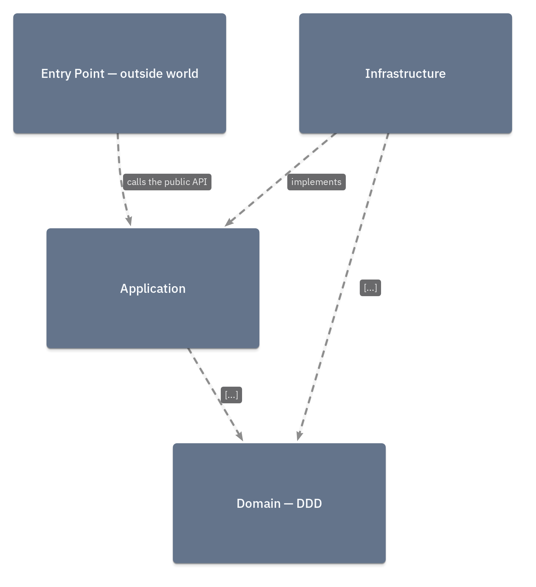
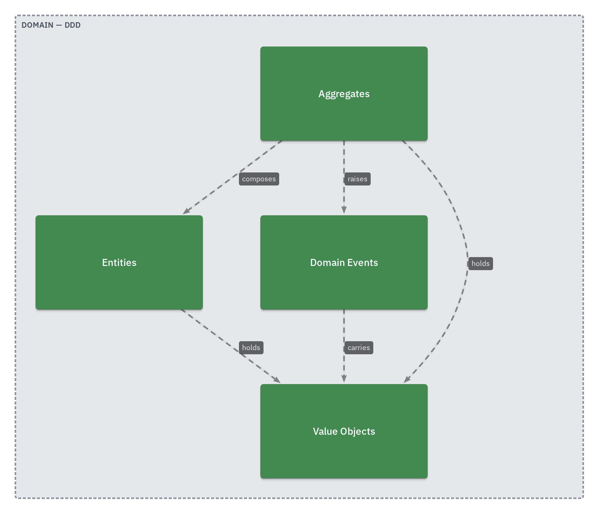

# Boundry

**Compile a C4 architecture diagram into a deterministic dependency linter.**

You draw the allowed architecture once, as a [LikeC4](https://likec4.dev) diagram.
Boundry turns it into a [dependency-cruiser](https://github.com/sverweij/dependency-cruiser)
ruleset and checks your code against it — locally and in CI. No model calls, no
heuristics, no judgement: the architecture you drew *is* the linter.

It's built for a world where AI agents write most of the code. Review doesn't
scale and LLM-judge supervisors are non-deterministic; Boundry gives agents a
hard boundary they can't cross instead of a suggestion they might.

```
diagram (LikeC4)  ──►  boundary model  ──►  dependency-cruiser rules  ──►  ✓ / ✗
     you draw            source-agnostic         generated                 the gate
```

## How it works

1. You annotate each element in your diagram with the folder it owns:
   `metadata { folder 'src/domain' }`.
2. Every relationship you draw (`a -> b`) is an **allowed** dependency.
   Anything you don't draw is **forbidden**.
3. Boundry lifts the diagram into a source-agnostic boundary model, compiles a
   dependency-cruiser ruleset from it, and runs the linter over your code.

Elements without a `folder` (actors, external systems, notes) are ignored, so a
rich communication diagram and an enforcement diagram can be the same file.

### Governing a whole root (opt-in)

By default a folder no element maps to is *ignored* — any module may import it.
That is what keeps a communication diagram usable as an enforcement diagram, but
it means brand-new, unmodelled code is free to import. Declare a root as fully
governed and the whole tree becomes the universe instead:

```likec4
system app 'App' {
  metadata { governRoot 'src' }
}
```

Now importing anything under `src/` that no module claims is a **violation**, and
`check` **warns** about code under the root that no module covers. That is the
mirror of the zero-files warning: the model failing to cover the code is as much
a gap as the code failing to back the model. Nothing changes unless you declare
it.

A mapped folder claims its **entire subtree**, so the abstraction level stays
yours: one box on `src/domain` covers everything beneath it. You add finer boxes
where you want finer *rules*, not to satisfy the coverage check.

### The composition root — `#anything`

Every repo has one place that legitimately imports everything: the entry point
that constructs the object graph. Give it a module and wire it to a wildcard:

```likec4
  // Owns 'src' minus every mapped descendant — the loose files at the root.
  module entry 'Composition root' {
    metadata { folder 'src' }
  }
  element anything 'Anything' {
    #anything
  }

  entry -> anything
```

A box tagged `#anything` maps to no folder and stands for "the rest of the code".
A module with an edge into it is exempt from every rule — and only that module;
the exemption doesn't leak.

The alternative was to leave `src/index.ts` unmapped, which grants it the same
freedom by **omission**: nothing drawn, nothing to review. The wildcard makes the
exemption a visible box someone approved on purpose.

## See it

The diagram you draw *is* the whole spec. Below is the example architecture that
Boundry's own end-to-end suite enforces — a hexagonal model with a pure DDD
core, CQRS, and a public-API boundary.

**[Explore every view interactively →](https://makspiechota.github.io/boundry/)**

### Top-level layers



### Inside the domain — the rules are what's *not* drawn

Aggregates compose Entities and hold Value Objects; Entities may reach Value
Objects but never Aggregates; Value Objects import nothing. Every missing arrow
is a forbidden dependency Boundry will reject.



## Install

```bash
npm install --save-dev boundry
```

Requires Node 20+. `likec4` and `dependency-cruiser` come along as dependencies.

## Quickstart

Draw your architecture — `arch/architecture.likec4`:

```likec4
specification {
  element module { style { shape rectangle } }
}

model {
  module domain 'Domain' {
    metadata { folder 'src/domain' }
  }
  module infra 'Infrastructure' {
    metadata { folder 'src/infra' }
  }

  // Allowed dependency. Everything not drawn is forbidden.
  infra -> domain
}

views {
  view index { include * }
}
```

Check your code against it:

```bash
npx boundry check --arch arch src
# ✓ no boundary violations                          (exit 0)
# ✗ src/domain/user.ts → src/infra/db.ts [boundary-domain]   (exit 1)
```

A `domain → infra` import is now a build failure; `infra → domain` is fine.

## Changing the architecture — propose, approve, commit

If agents can edit the diagram, they can grant themselves any dependency they
like, and the guardrail is theatre. So a change to the architecture goes through
a lifecycle:

**propose** → **approve** → **commit**

An agent blocked by a boundary adds the edge **with a marker**:

```likec4
  domain -> shared #proposed
```

A `#proposed` edge is *intent, not permission*. It's excluded from the allow-list,
so `check` stays red and the agent stays blocked. It has asked, not taken.

A human approves by stripping the marker — that's what `boundry approve` does,
deterministically, by splicing the LikeC4 CST. No model call, no reformatting:
source-preserving, idempotent, byte-exact.

```bash
boundry verify --arch arch --base origin/main   # any edge granted without a marker?
boundry approve --arch arch --base origin/main  # HUMAN ONLY: strip markers = approve
```

`verify` compares against the approved diagram at a git ref and rejects edges that
appeared *without* going through a proposal. Because proposals are excluded from
the allow-list, the newly-allowed set is exactly the set of self-approvals — no
diff engine required. `approve --base` runs the same gate first, so it won't
launder a self-granted edge into an approved one.

Point your agents at
[`.claude/skills/define-architecture-boundaries`](.claude/skills/define-architecture-boundaries/SKILL.md)
and they'll follow this protocol.

## CLI

```
boundry check    [--arch <dir>] [--cwd <dir>] [sources...]
boundry generate [--arch <dir>] [--cwd <dir>] [--out <file>]
boundry verify   [--arch <dir>] [--cwd <dir>] --base <git-ref>
boundry approve  [--arch <dir>] [--cwd <dir>] [--base <git-ref>]
```

| Flag | Meaning |
| --- | --- |
| `--arch <dir>` | LikeC4 workspace directory (all `.likec4` files in it are merged). Default `.`. |
| `--cwd <dir>` | Repo root to check. `folder` paths are relative to it. Lets you run from anywhere. |
| `--out <file>` | `generate` only: where to write the dependency-cruiser config. Default `.dependency-cruiser.cjs`. |
| `--base <ref>` | `verify`/`approve`: the git ref holding the approved diagram to compare against. |
| `sources...` | `check` only: paths to lint. Default `src`. |

- **`check`** compiles the rules and runs the linter. Exits non-zero on any violation.
- **`generate`** just emits the dependency-cruiser config so you can commit it or
  run `depcruise` yourself.
- **`verify`** rejects dependencies granted without a proposal.
- **`approve`** strips `#proposed` markers. For humans, not agents.

Boundry warns (but does not fail) when a mapped folder matches **zero** files, and
**fails outright** when a check analysed no files at all — so a passing check can
never silently enforce nothing. A guardrail that fails open is worse than none.

## CI

```yaml
# .github/workflows/architecture.yml
name: architecture
on: [push, pull_request]
jobs:
  boundry:
    runs-on: ubuntu-latest
    steps:
      - uses: actions/checkout@v4
      - uses: actions/setup-node@v4
        with: { node-version: 20 }
      - run: npm ci
      - run: npx boundry check --arch arch src
      # On PRs, also reject dependencies granted without a proposal.
      - run: npx boundry verify --arch arch --base origin/${{ github.base_ref }}
        if: github.event_name == 'pull_request'
```

## Programmatic use (SDK)

The CLI is a thin wrapper over the SDK. Everything is pluggable — the diagram
source and the target linter are both adapters behind ports.

```ts
import { Pipeline, LikeC4Visualizer, DepCruiserEnforcer } from 'boundry';

const pipeline = new Pipeline(
  new LikeC4Visualizer('arch'),
  new DepCruiserEnforcer(),
);

const result = await pipeline.check(['src']);
if (!result.ok) {
  for (const v of result.violations) console.error(`${v.from} → ${v.to}`);
  process.exit(1);
}
```

## Status & scope

Early but real — Boundry enforces its own architecture on itself, and ships an
end-to-end test suite covering a hexagonal + CQRS + DDD model (pure domain core,
read/write separation, a public-API boundary).

Today: **TypeScript** via dependency-cruiser, **LikeC4** as the diagram source.
Both are adapters, so more languages/linters and diagram formats can plug in
without touching the core.

Current limitations:

- One element maps to exactly one folder.
- Nesting is supported: you can map a parent folder *and* its children. A
  parent's edges govern only the parent's own files — a child never inherits
  them and must be permitted explicitly.
- `folder` paths are relative to the repo root (`--cwd`), not the diagram file.
- With a `governRoot`, unmapped code is blocked as an import *target* but is not
  yet constrained as an *importer* — rules are generated per mapped module, so
  unmapped code has no rules of its own.

See the [changelog](./CHANGELOG.md) for what's in each release.
**`0.1.0` is deprecated** — it silently enforces nothing (see the changelog).

## License

[MIT](./LICENSE) © Maksymilian Piechota
